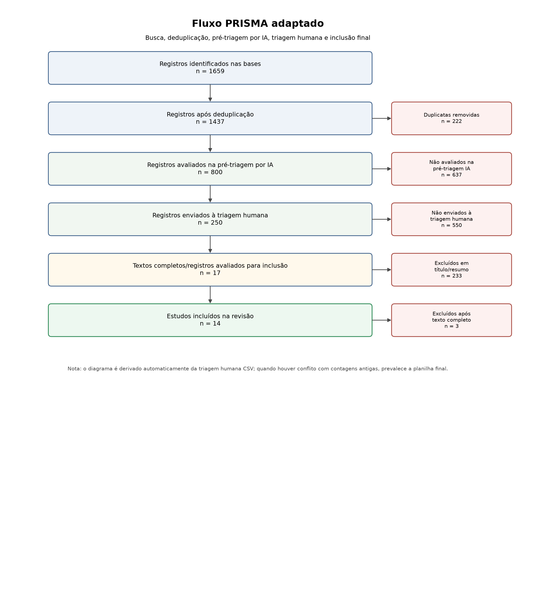

#+TITLE: Redesenho do fluxo de análise dos benefícios por incapacidade na Perícia Médica Federal: revisão de evidências sobre triagem documental, teleperícia e alocação de capacidade
#+AUTHOR: Gustavo M. Mendes de Tarso
#+DATE: 2026
#+LANGUAGE: pt-BR
#+OPTIONS: toc:t num:t
#+LATEX_CLASS: fgv-paper
#+LATEX_HEADER: \usepackage{longtable}
#+LATEX_HEADER: \usepackage{booktabs}
#+LATEX_HEADER: \usepackage{pdflscape}
#+LATEX_HEADER: \usepackage{array}
#+LATEX_HEADER: \usepackage[backend=biber,style=abnt,sorting=nty,giveninits=true]{biblatex}
#+LATEX_HEADER: \usepackage{graphicx}

* Identificação
- Perfil: =relatorio_prisma_busca_orientada_fgv=.
- Etapa: busca e triagem pendente.
- Layout institucional: paper_fgv.
- Projeto: prisma_fluxo_pmf.

* Questão e escopo da revisão
- Tema: Redesenho baseado em evidências do fluxo de análise dos benefícios por incapacidade na Perícia Médica Federal
- Recorte: Brasil; organização do fluxo entre análise documental, teleperícia, perícia presencial, capacidade ordinária e mutirões. O ATESTMED é tomado como referência institucional de análise documental, sem restringir a busca à experiência brasileira.
- Objetivo: Analisar evidências e alternativas para redesenhar o tratamento de requerimentos por incapacidade, combinando análise documental, avaliação remota, perícia presencial, capacidade territorial e critérios auditáveis de alocação.
- Pergunta de pesquisa: Como estruturar um fluxo de alocação de requerimentos entre análise documental, teleperícia e perícia presencial que reduza o tempo de espera sem comprometer a qualidade decisória, a equidade territorial e o controle?
- Tipo de estudo: revisão estruturada de evidências para análise e redesenho de política pública

* Protocolo de busca
- Estratégia: =blocos_tematicos=.
** Blocos e consultas executadas
- Benefícios por incapacidade e avaliação médico-pericial: =disability benefits AND medical assessment=
- Benefícios por incapacidade e avaliação médico-pericial: =incapacity benefit AND medical evaluation=
- Benefícios por incapacidade e avaliação médico-pericial: =work disability AND medical certification=
- Análise documental e elegibilidade: =documentary assessment AND disability=
- Análise documental e elegibilidade: =medical certificate AND disability benefits=
- Análise documental e elegibilidade: =medical documentation AND work incapacity=
- Teleperícia e avaliação remota: =remote medical assessment AND disability=
- Teleperícia e avaliação remota: =telemedicine AND disability assessment=
- Teleperícia e avaliação remota: =telehealth AND medical certification=
- Capacidade, filas e alocação de serviços: =disability benefits AND waiting time=
- Capacidade, filas e alocação de serviços: =medical assessment AND service capacity=
- Capacidade, filas e alocação de serviços: =case allocation AND disability services=
- Equidade territorial, qualidade e controle: =disability assessment AND equity of access=
- Equidade territorial, qualidade e controle: =remote assessment AND quality assurance=
- Equidade territorial, qualidade e controle: =medical certification AND audit=
- Palavras-chave: benefícios por incapacidade; disability benefits assessment; análise documental de incapacidade; documentary review disability claims; teleperícia; telemedicine disability evaluation; perícia médica presencial; triagem de requerimentos por incapacidade; work capacity assessment; gestão de filas em saúde; equidade territorial no acesso; auditabilidade de decisões administrativas
- Idiomas: português; inglês; espanhol
- Bases selecionadas: Crossref; OpenAlex; Semantic Scholar; Scopus; Web of Science; PubMed/NCBI; Europe PMC; SciELO; CORE

** Critérios de inclusão
- Estudos que analisem benefícios por incapacidade, afastamento por doença, seguro por incapacidade, certificação médica ou avaliação médico-pericial.
- Estudos que abordem triagem documental, elegibilidade, análise de documentos médicos, validação de atestados ou processos de decisão sobre incapacidade.
- Estudos que examinem teleperícia, telemedicina aplicada à avaliação, avaliação médica remota, videoperícia ou modalidades híbridas de avaliação.
- Estudos que analisem capacidade operacional, filas, tempo de espera, produtividade, priorização de casos, alocação de profissionais ou gestão de demanda em serviços periciais ou sistemas de benefícios.
- Estudos que discutam acesso territorial, equidade, barreiras geográficas, inclusão de populações remotas ou desigualdades de acesso à avaliação médico-pericial.
- Estudos que tratem de qualidade decisória, confiabilidade, auditoria, controle, integridade, prevenção de fraude, revisão de decisões ou riscos associados à avaliação remota ou documental.
- Estudos empíricos, avaliações de política pública, estudos de caso institucionais, revisões sistemáticas, revisões de escopo ou relatórios técnicos com evidência útil para a pergunta de pesquisa.
- Publicações em português, inglês ou espanhol.

** Critérios de exclusão
- Telemedicina exclusivamente assistencial, sem relação substantiva com avaliação de incapacidade, certificação, elegibilidade, triagem ou gestão de fluxos.
- Estudos clínicos que não contribuam para compreender processos de avaliação médico-pericial, decisão administrativa, capacidade, acesso, qualidade ou controle.
- Textos sem relação substantiva com a pergunta de pesquisa ou com ao menos um eixo da matriz analítica.
- Editorial, comentário, notícia, apresentação, resumo de congresso ou opinião sem análise, dados, revisão ou contribuição institucional verificável.
- Duplicidades entre bases ou consultas.
- Registros sem título, resumo ou metadados suficientes para triagem humana.
- Publicações em idioma diferente de português, inglês ou espanhol quando não houver informação suficiente para avaliação confiável.

* Registro por fonte
| Base | Registros recuperados | Situação |
|------+-----------------------+----------|
| Crossref | 300 | ok |
| OpenAlex | 300 | ok |
| Semantic Scholar | 200 | parcial |
| Scopus | 15 | ok |
| Web of Science | 0 | não executada: credencial ausente |
| PubMed/NCBI | 289 | ok |
| Europe PMC | 300 | ok |
| SciELO | 0 | bloqueada por anti-automação |
| CORE | 255 | parcial |

* Fluxo de seleção

#+CAPTION: Diagrama PRISMA adaptado ao fluxo de busca, pré-triagem por IA e triagem humana.
#+ATTR_LATEX: :width 0.95\textwidth

| Etapa | Quantidade |
|-+-|
| registros identificados | 1659 |
| duplicatas removidas | 222 |
| registros apos deduplicacao | 1437 |
| registros pre triagem ia avaliados | 1437 |
| registros enviados para triagem | 250 |
| triagem titulo resumo concluida | 250 |
| registros excluidos titulo resumo | 231 |
| textos completos avaliados | 19 |
| textos completos excluidos | 2 |
| estudos incluidos | 17 |
| registros na planilha | 250 |

A figura apresenta o funil de seleção da revisão. As contagens finais de triagem humana são derivadas do arquivo =triagem_humana.csv=; quando contagens intermediárias antigas entram em conflito com a planilha final, prevalece a reconciliação pela decisão humana final.

* Situação da triagem
A busca foi concluída, mas a inclusão e a exclusão de estudos permanecem pendentes de decisão humana na planilha de triagem.
- A planilha foi ordenada por pré-triagem assistida por IA antes do limite inicial de registros.
- A recomendação e a justificativa da IA servem apenas para priorização; elas não substituem a decisão humana.
- Planilha de triagem: =/home/gustavodetarso/Documentos/mppg/software/academic_pipeline_mppg/app_bundle/projetos/prisma_fluxo_pmf/output_pesquisa/relatorio_prisma_prisma_fluxo_pmf/relatorio_prisma_prisma_fluxo_pmf.triagem_titulo_resumo.xlsx=
- Após preencher a planilha, importe-a com =--prisma-importar-triagem=. O pipeline então produzirá a versão final deste relatório no mesmo layout e com a mesma engine PDF configurada no TOML.

* Nota metodológica
Este documento registra a estratégia de descoberta e a situação da triagem. Ele não apresenta a busca como revisão concluída nem substitui a avaliação humana dos títulos, resumos e textos completos.
